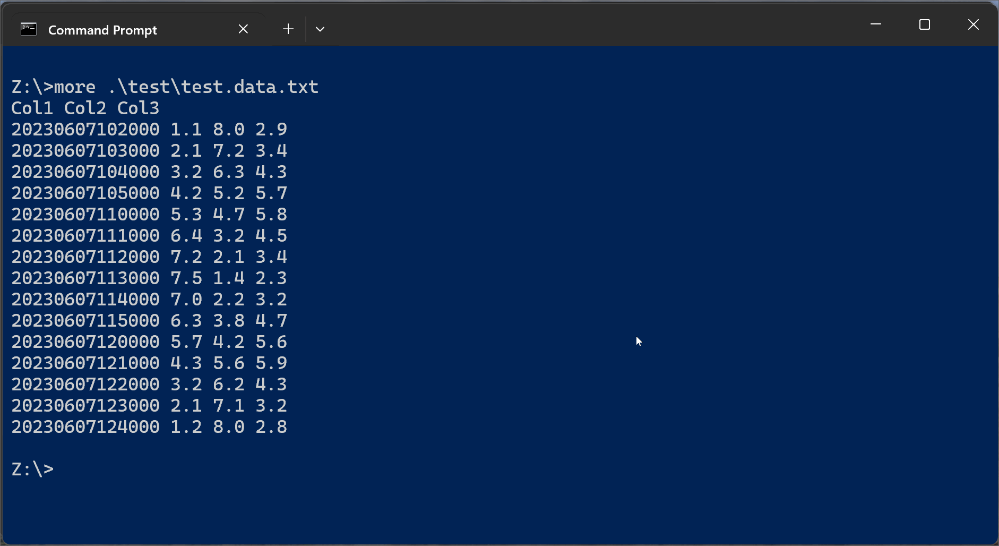

# ToGraph

toGraph convert a data file to html page with a diagram ([Annotation Chart](
https://developers.google.com/chart/interactive/docs/gallery/annotationchart))




## Usage:
```sh
$ toGraph -h
usage: toGraph [<flags>] file
  -cf
        column names in the first row of the data file
  -columns string
        column names, separated by commas.
  -d string
        field separator (default " ")
  -h    print usage
  -o string
        output file name
  -pc int
        pivot column
  -t string
        time field format (YYYY-MM-DDTHH:mm:SS.ssssss) (default "YYYYMMDDHHmmSS")
  -tc int
        ordinal number of the column with time (default 1)
```
